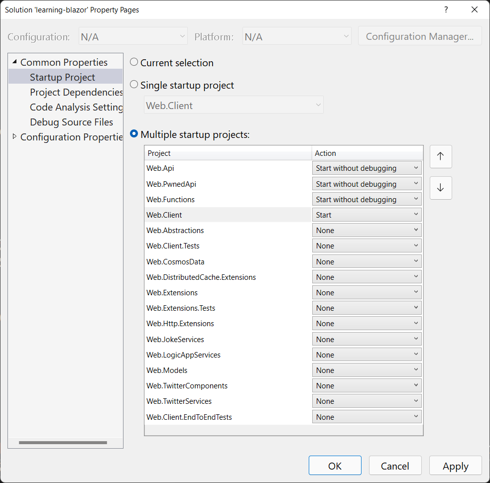

# Get Started

In order to run this app locally, you'll need to configure a few things first.

## Environment Variables

There are a number of environment variables (or configuration) that is required for the app to run.

## Configure **Open Weather Map** API

- [Open Weather API](https://openweathermap.org/full-price#current)

> I personally use the free version.

| Key                             | Data type | Default value |
|---------------------------------|-----------|---------------|
| `OpenWeatherMapOptions__ApiKey` | `string`  | `null`        |

## Configre **Have I Been Pwned** API

- [**Have I Been Pwned** API](https://haveibeenpwned.com/api/key)

| Key                      | Data type | Default value                              |
|--------------------------|-----------|--------------------------------------------|
| `HibpOptions__ApiKey`    | `string`  | `null`                                     |
| `HibpOptions__UserAgent` | `string`  | `".NET HIBP Client/{AssemblyFileVersion}"` |

For more information, see [';-- have i been pwned? — .NET HTTP client.](https://github.com/IEvangelist/pwned-client).

[](https://www.nuget.org/packages/HaveIBeenPwned.Client)

## Configure Logic App

The `/contact` uses a Logic App endpoint to send an email. In order for the app to correctly send this email, the app expects the following config value:

| Key                           | Data type | Default value |
|-------------------------------|-----------|---------------|
| `LogicAppOptions__ContactUrl` | `string`  | `null`        |

For more information, see [Microsoft Azure: Create Logic App](https://portal.azure.com/#create/Microsoft.LogicApp).

The shape of the HTTP post body:

```json
{
    "firstName": "David",
    "lastName": "Pine",
    "fromEmail": "example@email.org",
    "subject": "Just want'ed to say \"Hi\"!",
    "body": "... but now I'm a bit nervous."
}
```

## Running the app

The app is architected into microservices.

- The `Web.Client` project is the Blazor WebAssembly client app.
- The `Web.Api` project is a Web API project with.
- The `Web.PwnedApi` project is a Minimal API project.
- The `Web.Functions` project is an Azure Functions app.

All of these need to be started. The `Web.Client` relies on the other three project's APIs.
They need to be started before the `Web.Client` app. Add (or update) each project's _launchSetting.json_ file:

### `Web.Client`

Save the _./src/Web.Client/Properties/launchSettings.json_ as follows:

```json
{
  "profiles": {
    "Web.Client": {
      "commandName": "Project",
      "dotnetRunMessages": true,
      "launchBrowser": true,
      "inspectUri": "{wsProtocol}://{url.hostname}:{url.port}/_framework/debug/ws-proxy?browser={browserInspectUri}",
      "applicationUrl": "https://localhost:5001",
      "environmentVariables": {
        "ASPNETCORE_ENVIRONMENT": "Development"
      }
    }
  }
}
```

### `Web.Api`

Save the _./src/Web.Api/Properties/launchSettings.json_ as follows:

```json
{
  "profiles": {
    "Web.Api": {
        "commandName": "Project",
        "launchBrowser": false,
        "environmentVariables": {
            "ASPNETCORE_ENVIRONMENT": "Development"
        },
        "applicationUrl": "https://localhost:5002"
    }
  }
}
```

### `Web.PwnedApi`

Save the _./src/Web.PwnedApi/Properties/launchSettings.json_ as follows:

```json
{
  "profiles": {
    "Web.PwnedApi": {
        "commandName": "Project",
        "launchBrowser": false,
        "environmentVariables": {
            "ASPNETCORE_ENVIRONMENT": "Development"
        },
        "applicationUrl": "https://localhost:5003"
    }
  }
}
```

### `Web.Functions`

Save the _./src/Web.Functions/local.settings.json_ as follows:

```json
{
    "IsEncrypted": false,
    "Values": {
        "AzureWebJobsStorage": "",
        "FUNCTIONS_WORKER_RUNTIME": "dotnet"
    },
    "Host": {
        "LocalHttpPort": 5004,
        "CORS": "*",
        "CORSCredentials": false
    }
}
```

If you're using Visual Studio, right-click the solution file in the **Solution Exporer**. From the
context menu select **Set Startup Projects**.


