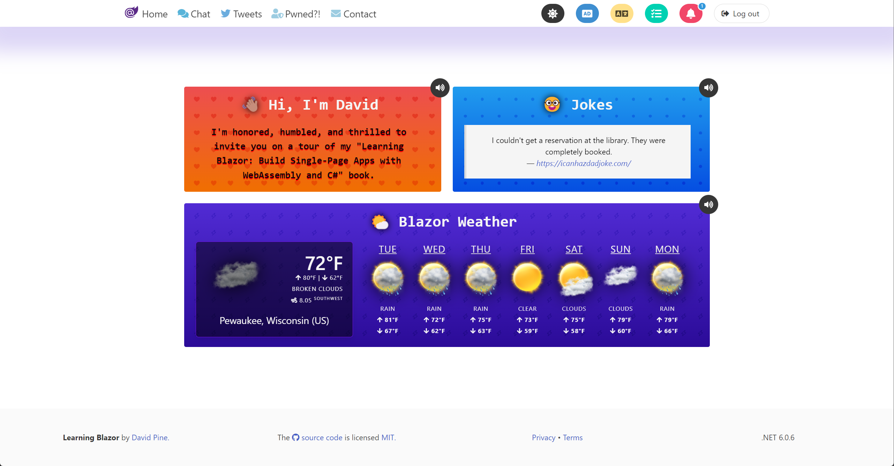

# Learning Blazor: Build Single-Page Apps with WebAssembly and C#

| Book | Details |
|--|--|
|  | This repository is the application detailed in the ["Learning Blazor: Build Single-Page Apps with WebAssembly and C#"][learning-blazor] O'Reilly Media book by David Pine. Take advantage of your C# skills to build UI components and client-side experiences with .NET. With this practical guide, you'll learn how to use Blazor WebAssembly to develop next-generation web experiences. Built on top of ASP.NET Core, Blazor represents the future of .NET single-page applications (SPA) investments. |

| Status | Description |
|--:|:--|
|  | Wether the current source code builds successfully, and all tests pass. |
|  | The current CodeQL security / vulnerability scan result. |
|  | Wether the last machine-translation run was successful. |
|  | The status of the last deployment of the Azure Static Web app. |
|  | The status of the last deployment of the Azure Functions app. |
|  | The status of the last deployment of the Azure Web API. |
|  | The status of the last deployment of the Azure Pwned Web API. |

## Architecture

_**The following is an ASP.NET Core hosting diagram:**_

> Powered by Mermaid.js
> &mdash; [🔗 Include diagrams in your Markdown files with Mermaid](https://github.blog/2022-02-14-include-diagrams-markdown-files-mermaid/)

## Home screen (dark theme)

## Home screen (light theme)

Featuring:

- C# 10
- .NET 6
- Blazor WebAssembly
- Blazor Third-Party Authentication providers:
  - Google
  - Twitter
  - GitHub
  - "Sign up now"-based identity provider registration (with email verification).
- Azure Functions &mdash; .NET
- ASP.NET Core Web API
- ASP.NET Core SignalR
- Bulma (CSS)
- Polly
- Swagger / OpenAPI
- Twitter API
- OpenWeatherMap API
- "Have I Been Pwned"
- Client-Browser Native Speech Synthesis and Speech Recognition
- Reactive Extensions (Rx.NET)
- Azure Cosmos DB Repository-Pattern .NET SDK
- Blazor WebAssembly Localization
- Azure Cognitive Services Translator
- Blazor Component Virtualization
- Two-way JavaScript Interop (using both `IJSRuntime` and `IJsInProcessRuntime`)
  - As well as Blazorators, for source generation

> [💡 Ideas](https://gist.github.com/IEvangelist/d43abafb64d207bff25e60769e986bbd) for the application to include.

[learning-blazor]: https://bit.ly/learning-blazor
